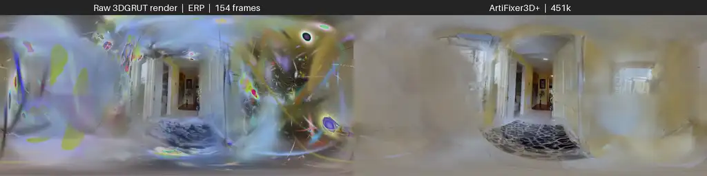
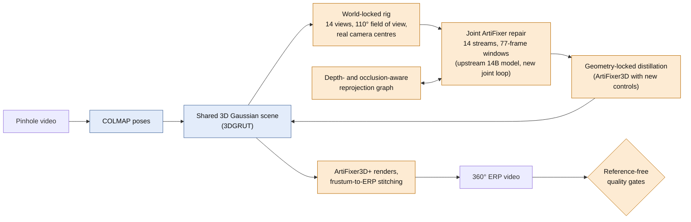
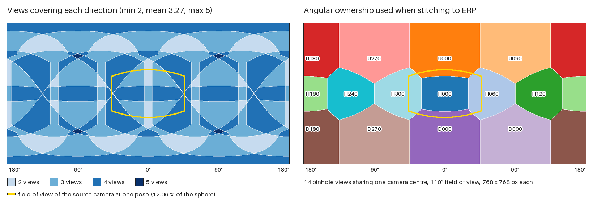
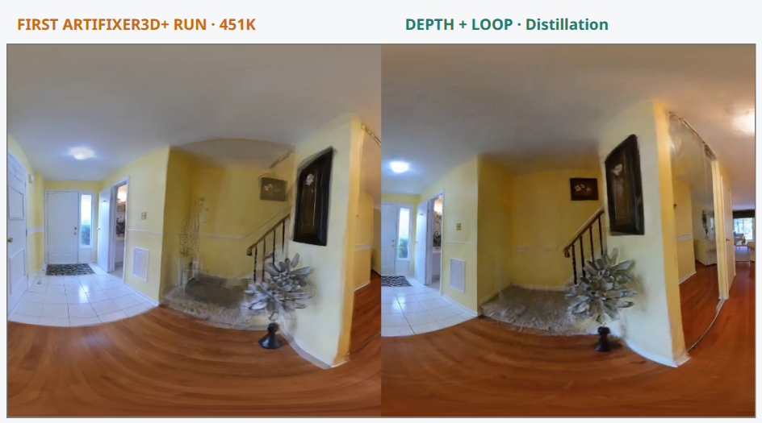

<!--
SPDX-FileCopyrightText: Copyright (c) 2026 NVIDIA CORPORATION & AFFILIATES.
SPDX-FileCopyrightText: Modifications Copyright (c) 2026 Guilhem Carmouze.
SPDX-License-Identifier: Apache-2.0
-->

# ArtiFixer 360 Pipeline

Research code from a 2026 internship at AIST (Tsukuba, Japan) whose goal was to
produce 360° observations for robot visual navigation: it turns an ordinary
pinhole video into a 360° equirectangular (ERP) video by rendering a 3D Gaussian
scene through a 14-view rig and repairing the renders with NVIDIA's ArtiFixer
video diffusion model.

**Author of the 360° extension:** Guilhem Carmouze, robotics engineering student at
UPSSITECH (University of Toulouse). Internship host: Computer Vision Research Team,
Artificial Intelligence Research Center, AIST, April–August 2026.
Derivative of [NVIDIA ArtiFixer](https://github.com/nv-tlabs/ArtiFixer) (Apache-2.0).

[](https://github.com/guilhem0908/artifixer-360-pipeline/actions/workflows/cpu-tests.yml)


[](docs/assets/readme/gauvain_154f_3DGRUT-brut-ERP_vs_ArtiFixer3Dplus-451k.mp4)

*Left: raw 3DGRUT render of the reconstructed scene, projected to ERP. Right: the
same 154 frames and camera path after the first ArtiFixer3D+ run (labelled 451k).
Most holes and splatting noise are removed; residual warping and duplicated
structures remain, and regions the camera never saw are generated, not observed.
Click for the [full-resolution MP4](docs/assets/readme/gauvain_154f_3DGRUT-brut-ERP_vs_ArtiFixer3Dplus-451k.mp4)
(2048 x 512, 10 s).*

> **Research status.** The recipes are documented and the tooling is tested, but
> the method does not guarantee panoramas without visible seams or with correct
> geometry. One shorter run passed its quality gates; the full fourteen-direction
> run failed them. Both outcomes are reported below with their numbers. This
> repository contains no robot navigation code: it is the stage of the internship
> that builds the 360° imagery from a plain video.

## Contents

- [How it works](#how-it-works)
- [Results](#results)
- [What works and what does not](#what-works-and-what-does-not)
- [What I built on top of upstream](#what-i-built-on-top-of-upstream)
- [Requirements](#requirements)
- [Quickstart on a CPU](#quickstart-on-a-cpu)
- [Running the full pipeline](#running-the-full-pipeline)
- [Evaluation metrics](#evaluation-metrics)
- [Repository layout](#repository-layout)
- [Limitations](#limitations)
- [Related repositories](#related-repositories)
- [Upstream attribution and license](#upstream-attribution-and-license)

## How it works

ArtiFixer was trained on pinhole video. A panorama needs the whole sphere, while
the source camera used during development sees only 12.06% of it at one pose
(93.72° × 60.93° field of view, focal length 924.0169 px). The pipeline therefore
keeps the real camera centres, re-orients a virtual rig around each of them and
asks the model to repair perspective views that overlap.



Blue boxes are upstream components (COLMAP preparation and the 3DGRUT scene come
with ArtiFixer); orange boxes were added or extended in this repository.

1. **Poses and scene.** COLMAP poses and a 3DGRUT Gaussian scene, as in upstream
   ArtiFixer, plus an all-frame COLMAP 4.1.1 driver (ALIKED + LightGlue, one shared
   camera).
2. **Rig.** Fourteen 110° pinhole views per source pose: six horizontal at 60°
   steps, four pitched up by 45° and four pitched down by 45°. They share the real
   camera centre, so views differ by a pure rotation. Trajectory generators cover
   world-locked lanes, a forward-facing smoothed rig and a continuous "spherical
   snake" whose consecutive frames rotate by at most 5°.
3. **Joint repair.** The 14 streams are denoised together in 77-frame windows.
   Overlapping views exchange information through a reprojection graph filtered by
   depth and opacity, with a required horizontal loop closure (`H300 ↔ H000`), and
   real frames are reinserted as anchors.
4. **Distillation.** Repaired views are distilled back into the shared scene with
   optional locks (positions, rotations, scales and densities frozen) and depth,
   colour-loop and single-surface losses; a bitwise audit checks that locked
   tensors did not move. The trainer-side controls live in the
   [3DGRUT-ArtiFixer-360](https://github.com/guilhem0908/3DGRUT-ArtiFixer-360)
   submodule.
5. **Panorama.** Perspective frusta are projected to ERP with angular ownership,
   feather, multiband or graph-cut seams, exposure gain solving and temporal label
   smoothing.
6. **Quality gates.** Depth-overlap error, optical-flow temporal warp, ERP
   wrap-seam ratio, edge retention and the geometry-lock audit decide whether a
   run is published.



*Computed on the pipeline's 1024 x 512 ERP grid with the repository's own rig and
projection code (`python scripts/render_rig_coverage_figure.py`, values in
[docs/results/rig_coverage.json](docs/results/rig_coverage.json)): every direction
is seen by at least 2 and at most 5 of the 14 views, 3.27 on average, and 86.7% of
the sphere by 3 or more. The yellow outline is what the source camera sees.*

The editable framework diagram used during the internship is kept in the
[framework archive](docs/framework/README.md).

## Results

All values except the rig coverage come from GPU runs made during the internship
and are transcribed from the dated records under `docs/`. The raw QC reports
stayed on the cluster, so they cannot be recomputed from this repository; the
test suite only checks that the README, [docs/results/reported_metrics.json](docs/results/reported_metrics.json)
and the source records agree. Lower is better unless stated otherwise.

| What was measured | Value | Reading | Record |
|---|---|---|---|
| Cross-view depth-overlap MAE of the repaired views, **before distillation**, without → with depth-aware synchronisation | 0.03396 → 0.02471 (27.25% lower) | Positive, limited scope: measured on the repaired pseudo-views, including the `H300 ↔ H000` closure pair | [handover](docs/artifixer_abci_handover_2026-08-20.md) |
| Same change **after distillation**, final ERP: first 451k run vs depth + loop variant | temporal warp MAE 0.02329 vs 0.02582; seam MAE 0.01143 vs 0.01174 | **Negative.** The pseudo-view gain did not clearly survive distillation | [handover](docs/artifixer_abci_handover_2026-08-20.md) |
| 117-frame reference run, 14 views (1,638 renders at 768 x 768): optical-flow temporal warp MAE, raw renders → output (median) | 0.03732 → 0.02016; edge flicker 0.03422 → 0.01627 | Positive. Verdict `PASS_FORWARD14_DEPTHPEER77_PILOT`, final job wall-clock 00:20:21 on one 4-GPU node | [handover](docs/artifixer_abci_handover_2026-08-20.md) |
| Same run: edge strength kept in high-confidence regions (1 = fully kept) | 0.4859 median, 0.3653 for the weakest view | Caveat: part of the stability comes with softer detail; weakly observed lateral areas stay soft or smeared | [handover](docs/artifixer_abci_handover_2026-08-20.md) |
| Same run: COLMAP pose reconstruction | 117/117 images registered, 24,933 points, median reprojection error about 0.952 px | Context | [handover](docs/artifixer_abci_handover_2026-08-20.md) |
| Optional two-yaw VEnhancer post-process on that output: temporal warp MAE, edge flicker | 0.02020 → 0.01339 (-33.7%); 0.01627 → 0.01009 (-38.0%) | Perceptual smoothing only; it can reinterpret weak texture and validates no geometry | [handover](docs/artifixer_abci_handover_2026-08-20.md) |
| Repairing six cubemap faces independently: mean seam-failure fraction over the 12 face adjacencies (fails above 0.1), raw → repaired | 0.3420 (11/12 failing) → 0.8328 (12/12 failing) | **Negative.** Cleaning each face made the seams much worse | [NO-GO report](docs/gauvain_artifixer_no_go_2026-07-22.md) |
| Geometry-locked 3D variant, same seam metric | 0.0000 (0/12 failing) | Consistent only because geometry cannot move: the geometric artifacts stay | [NO-GO report](docs/gauvain_artifixer_no_go_2026-07-22.md) |
| Full 154-frame, fourteen-direction run (2,156 perspective views, 1024 x 512 ERP) | `PASS_FULL_SPHERICAL_COVERAGE`, then `QC_FAIL_VISUAL_AND_TEMPORAL`: circular seam 7.65x local contrast; max temporal warp MAE 0.1298 (threshold 0.10); max temporal p95 0.4196 (threshold 0.30); max black fraction 3.77% | **Negative.** Complete coverage and exact source-pixel reinsertion, but the output failed the acceptance gates, which led to a geometry-first redesign | [progress report](docs/weekly_progress/2026-08-09.md) |
| Share of the sphere seen by the source camera at one pose | 12.06% (93.72° × 60.93°, focal 924.0169 px) | Root cause of the difficulty; recomputed from the intrinsics by the tests | [NO-GO report](docs/gauvain_artifixer_no_go_2026-07-22.md) |
| Earlier baseline, not this pipeline: video → COLMAP → Splatfacto, 70/30 split | PSNR 26.08 dB / SSIM 0.91 at 30k iterations; 28.69 dB / 0.94 at 60k | Context for the reconstruction stage | [weekly note](docs/weekly_progress/2026-05-18.md) |



*Left: first ArtiFixer3D+ run at 451k. Right: depth + loop distillation. The
depth/loop branch changes local structure and appearance, but distortions remain;
this is a qualitative diagnostic, not a claim of correct geometry.*

The complete experiment matrix, the closed campaign and the week-by-week notes are
in the [dated handover](docs/artifixer_abci_handover_2026-08-20.md), the
[NO-GO report](docs/gauvain_artifixer_no_go_2026-07-22.md), the
[weekly progress archive](docs/weekly_progress/README.md) and the
[final internship report (PDF)](docs/assets/readme/Rapport_de_stage_2026_CARMOUZE_Guilhem.pdf).

## What works and what does not

| Component | Status | Evidence |
|---|---|---|
| Trajectory and manifest generators, frustum-to-ERP stitcher, QC metrics, run-contract and job-script checks | Works on a CPU | 140 tests in [`tests/cpu_subset.txt`](tests/cpu_subset.txt), run by CI |
| 117-frame synchronized run with a forward-facing 14-view rig | Passed its depth, detail and temporal gates during the internship | Dated handover |
| Full 154-frame, fourteen-direction ERP video | Complete coverage, **failed** the visual and temporal gates | Progress report of 2026-08-09 |
| Depth-aware synchronisation | Improves agreement of the repaired views; the gain is **not preserved** by the current distillation | Results table |
| Per-face cubemap repair, direct ERP repair, independent 360° frame editors | **Rejected** after measurement | NO-GO report |
| Geometry-locked distillation | Seam-consistent but keeps the geometric artifacts of the base scene | NO-GO report |
| Reproducing the GPU runs | **Not possible from this repository alone**: source footage, container images and checkpoints are not included, and the reference job script is specialised to 117 frames | Dated handover |
| GPU inference and distillation in CI | Not run; only the CPU subset is automated | [`cpu-tests.yml`](.github/workflows/cpu-tests.yml) |
| Upstream evaluation tests (DL3DV, Nerfbusters, attention benchmarks) | Not maintained here; they need the full container and some assert the upstream README text | `tests/` |

## What I built on top of upstream

The repository keeps the upstream history: five commits by the NVIDIA authors up
to [`c320752`](https://github.com/nv-tlabs/ArtiFixer/commit/c3207529847bd951b6e0c71a501887076191bdbd),
then the internship work, pushed as five commits on 20 and 21 August 2026 (the
week-by-week progression is in the [progress archive](docs/weekly_progress/README.md),
not in the commit graph). The table is generated by
`python scripts/report_upstream_delta.py --markdown` from `git diff --numstat`
between the upstream base and the last internship commit; the full report is
[docs/results/upstream_delta.json](docs/results/upstream_delta.json).

| Area | Files added | Files modified | Lines added | Lines removed |
|---|---:|---:|---:|---:|
| Pipeline scripts: trajectories, manifests, targets, stitching, QC | 36 | 0 | 10,050 | 0 |
| PBS / Singularity job scripts | 6 | 0 | 1,906 | 0 |
| Inference, model and distillation code | 3 | 16 | 4,026 | 144 |
| Tests | 32 | 3 | 3,249 | 8 |
| Documentation and progress archive | 26 | 0 | 2,148 | 0 |
| Framework diagram generator and validators | 15 | 0 | 1,994 | 0 |
| Top-level notices, README and configuration | 3 | 5 | 229 | 478 |
| **Total** | **121** | **24** | **23,602** | **630** |

The tests row covers 32 new test modules holding 119 test functions. The companion
patch in the 3DGRUT submodule is +506 / −74 lines in 12 files on
`nv-tlabs/3DGRUT-ArtiFixer@62e1038`.

Key files:

| File | Role | Size |
|---|---|---|
| [`model_eval/synchronized_multiview.py`](model_eval/synchronized_multiview.py) | Same-centre reprojection grids, depth- and opacity-filtered view graph, loop validation, latent and noise consensus | new, 573 lines |
| [`model_eval/run_synchronized_multiview_inference.py`](model_eval/run_synchronized_multiview_inference.py) | Joint 14-view denoising loop: per-view encoding, micro-batched transformer calls, consensus before the scheduler step, raised-cosine merge of temporal windows | new, 1,176 lines |
| [`scripts/generate_spherical_snake_trajectory.py`](scripts/generate_spherical_snake_trajectory.py) | Continuous snake over the sphere with alternating lanes and a bounded angular step | new, 331 lines |
| [`scripts/stitch_artifixer_frustums360.py`](scripts/stitch_artifixer_frustums360.py) | Frustum-to-ERP projection, angular ownership, feather / multiband / graph-cut seams, exposure gains | new, 676 lines |
| [`scripts/panorama_metrics.py`](scripts/panorama_metrics.py) | ERP wrap-seam and optical-flow temporal metrics used by the quality gates | new, 149 lines |
| [`data_processing/artifixer3d.py`](data_processing/artifixer3d.py) | Distillation wrapper: geometry lock, opacity-prune lock, depth, colour-loop and single-surface controls | upstream file, +440 / −9 |
| [`model_training/net/transformer.py`](model_training/net/transformer.py) | Inference-only, memory-bounded chunked paths so a 77-frame, 14-view context fits on the GPUs | upstream file, +563 / −96 |

Everything else under `model_training/`, the base inference and evaluation code,
the Dockerfiles and the model itself are NVIDIA's work (see
[Upstream attribution and license](#upstream-attribution-and-license)).

**AI assistance.** As declared in the appendix of the internship report, AI tools
were used for literature research, for writing code and for spell-checking; they
were not used to run the experiments or to produce the results. The October 2026
housekeeping commits (this README, the CPU test workflow, the figures) carry a
`Co-Authored-By` trailer.

## Requirements

| Stage | Hardware | Software | Recorded runtime |
|---|---|---|---|
| Tooling, tests and README figures | Any CPU, no GPU | Python 3.10 or newer with [`requirements-dev.txt`](requirements-dev.txt) (NumPy, OpenCV, Pillow, PyTorch CPU, pytest) | Dependencies install in about 80 s; the 140 tests take about 5 s in a Python 3.12 Linux container and about 30 s on Windows 11 with Python 3.14 (laptop CPU); each figure script takes under 30 s |
| Pose reconstruction | One `rt_QG` node of the ABCI cluster | COLMAP 4.1.1 with ALIKED + LightGlue, in its own container | Not recorded |
| 3DGRUT scene, joint inference, stitching, QC | One `rt_QF` node with 4 GPUs (`torchrun --nproc_per_node=4`, context parallel size 4). The distillation job notes that geometry-locked training can fill almost all of an 80 GiB GPU; the GPU model is not recorded | Image built from [`Dockerfile.cuda12`](Dockerfile.cuda12) (`nvcr.io/nvidia/pytorch:25.01-py3`, PyTorch 2.11.0 / CUDA 12.8), run through Singularity under PBS | 00:20:21 for the final job of the 117-frame reference run |
| Model assets | Disk and Hugging Face access | `nvidia/ArtiFixer` (`artifixer-14b.pt`), `Ruicheng/moge-2-vitl-normal`, `Wan-AI/Wan2.1-T2V-14B-Diffusers` | — |

## Quickstart on a CPU

This runs the tooling that needs neither a GPU, nor the checkpoint, nor the
submodule. A plain clone is enough.

```bash
git clone https://github.com/guilhem0908/artifixer-360-pipeline.git
cd artifixer-360-pipeline
python -m venv .venv
source .venv/bin/activate                 # Windows: .venv\Scripts\activate
pip install torch --index-url https://download.pytorch.org/whl/cpu
pip install -r requirements-dev.txt

python -m pytest -q @tests/cpu_subset.txt            # 140 tests
python scripts/render_rig_coverage_figure.py         # rig coverage statistics and figure
python scripts/report_upstream_delta.py --markdown   # the table above, from Git
```

On Windows accounts without Developer Mode, four tests that create symbolic links
are reported as skipped. `python scripts/build_readme_comparison.py` rebuilds the
looping preview at the top of this page from the versioned MP4.

## Running the full pipeline

These steps need the GPU environment described above. They were run on the
cluster during the internship and have not been re-run since.

Clone recursively, because the 3DGRUT fork holds the distillation changes:

```bash
git clone --recurse-submodules \
  https://github.com/guilhem0908/artifixer-360-pipeline.git
cd artifixer-360-pipeline
```

Build one of the upstream CUDA containers and download the ArtiFixer checkpoint:

```bash
docker build -f Dockerfile.cuda12 -t artifixer360:cuda12 .
huggingface-cli download nvidia/ArtiFixer artifixer-14b.pt \
  --local-dir /data/checkpoints/artifixer
```

Validate the checkout without running inference:

```bash
python scripts/validate_artifixer360_install.py \
  --checkpoint /data/checkpoints/artifixer/artifixer-14b.pt
```

The first reconstruction stage expects a COLMAP scene:

```text
scene/
  images/
  sparse/0/
    cameras.bin
    images.bin
    points3D.bin
```

Prepare the initial scene as in upstream ArtiFixer:

```bash
python -m data_processing.prepare_colmap_artifixer_inputs \
  --colmap_dir /data/scene \
  --output_root /data/prepared/base_scene \
  --reconstruction_steps 30000
```

The panorama extension then reuses the prepared transforms, the selected real
anchors, the metric scale and the 3DGRUT checkpoint. Copy the variable template
(`cp configs/artifixer360.example.env configs/artifixer360.env`) and follow one of
the two documented branches:

- [Snake pipeline](docs/SNAKE_PIPELINE.md): winding perspective trajectory,
  ArtiFixer2D, canonical targets, distillation, ArtiFixer3D+ and ERP output.
- [Synchronized multi-view pipeline](docs/DEPTH_LOOP_PIPELINE.md): joint 14-view
  windows, depth-aware consensus and horizontal loop closure.

Supporting documents:

- [Cluster execution](docs/ABCI.md): portable PBS template and four-GPU launch.
- [Handover guide](docs/HANDOVER.md): data contract, smoke test, expected outputs
  and troubleshooting.
- [Dated handover](docs/artifixer_abci_handover_2026-08-20.md): the exact 117-frame
  protocol, runtime pins, off-trajectory findings and failure modes.

No source video, dataset, full generated sequence, checkpoint, credential or
cluster-specific path is included in the repository; examples use environment
variables and `/path/to/...` placeholders.

## Evaluation metrics

No single RGB score proves correct geometry, so several complementary
measurements are used:

| Metric | Meaning | Direction |
|---|---|---|
| Depth-overlap MAE | Relative depth disagreement after cross-view reprojection | lower |
| Loop-pair error | Agreement of the final and initial horizontal directions | lower |
| Circular temporal warp MAE | Frame-to-frame ERP stability after optical flow | lower |
| ERP seam ratio | Wrap discontinuity relative to adjacent columns | lower |
| Edge-strength ratio | Structural detail retained from high-confidence input | closer to 1 |
| Geometry-lock audit | Bitwise equality of position, rotation, scale and density | must pass |

```bash
python scripts/evaluate_depth_synchronized_multiview.py --help
python scripts/evaluate_temporal_panorama.py --help
python scripts/audit_artifixer3d_checkpoint_lock.py --help
```

## Repository layout

```text
data_processing/   COLMAP/3DGRUT preparation and ArtiFixer3D distillation
model_eval/        standard and synchronized ArtiFixer inference
model_training/    upstream model plus multi-view feature plumbing
scripts/           trajectory, synchronization, stitching, QC and job scripts
configs/           portable environment template
docs/              pipeline guides, dated records, progress archive, results
presentations/     framework diagram generator and its validators
tests/             unit tests; tests/cpu_subset.txt lists the CPU-only subset
thirdparty/        the linked 3DGRUT-ArtiFixer-360 submodule
```

## Limitations

- Temporal feature sharing is not equivalent to sharing a persistent 3D surface.
- A perspective-video model does not learn spherical wrap or pole topology by
  default.
- The snake makes rotations less out-of-distribution, but cannot enforce
  bidirectional loop closure by itself.
- Depth and loop conditioning improved the synchronized pseudo-views in the
  diagnostic experiment, but the following 3D distillation did not consistently
  preserve that improvement in the final ERP.
- Hidden regions remain generative hypotheses, not captured photographic truth.
- The quantitative evidence is limited to two indoor clips (154 and 117 frames)
  and a small number of runs; no ground-truth panoramas were available, so all panorama metrics are
  reference-free.
- The reference job scripts are tied to one cluster layout and to a 117-frame
  clip; adapting them to another length needs code and test changes.

These limitations are stated because they determine which future experiments are
scientifically meaningful.

## Related repositories

The internship covered more than this stage:

- [nav_3dgs_pano](https://github.com/guilhem0908/nav_3dgs_pano): first phase,
  navigation and panoramic rendering inside a supplied 3D Gaussian scene in
  simulation (occupancy grid, A* planning, six views re-projected to an
  equirectangular panorama with pose and command logging).
- [KachakaNavigation](https://github.com/guilhem0908/KachakaNavigation): ROS 2
  interface prepared to run a visual navigation model on the Kachaka mobile robot
  (image relay, command safety, dry-run mode). The model inference is not wired in
  and no navigation run on the real robot was completed.
- [3DGRUT-ArtiFixer-360](https://github.com/guilhem0908/3DGRUT-ArtiFixer-360):
  NVIDIA's 3DGRUT-ArtiFixer plus the distillation controls used here, consumed as
  the `thirdparty/3DGRUT-ArtiFixer` submodule.

## Upstream attribution and license

This repository is a derivative of the official NVIDIA ArtiFixer codebase
(Riccardo de Lutio and co-authors). Original source files retain their NVIDIA
copyright and SPDX notices. The modifications are summarised in
[MODIFICATIONS.md](MODIFICATIONS.md) and itemised file by file in
[docs/results/upstream_delta.json](docs/results/upstream_delta.json). The project is distributed under Apache-2.0;
see [LICENSE](LICENSE), [NOTICE](NOTICE) and
[THIRD-PARTY-NOTICES.md](THIRD-PARTY-NOTICES.md). It also relies on COLMAP,
3DGRUT, MoGe, the Wan 2.1 video model, OpenCV and PyTorch.

Please cite the original ArtiFixer work:

```bibtex
@inproceedings{delutio2026artifixer,
  title={ArtiFixer: Enhancing and Extending 3D Reconstruction with Auto-Regressive Diffusion Models},
  author={de Lutio, Riccardo and Fischer, Tobias and Chang, Yen-Yu and Zhang, Yuxuan and
          Wu, Jay Zhangjie and Ren, Xuanchi and Shen, Tianchang and Tothova, Katarina and
          Gojcic, Zan and Turki, Haithem},
  booktitle={SIGGRAPH},
  year={2026}
}
```
