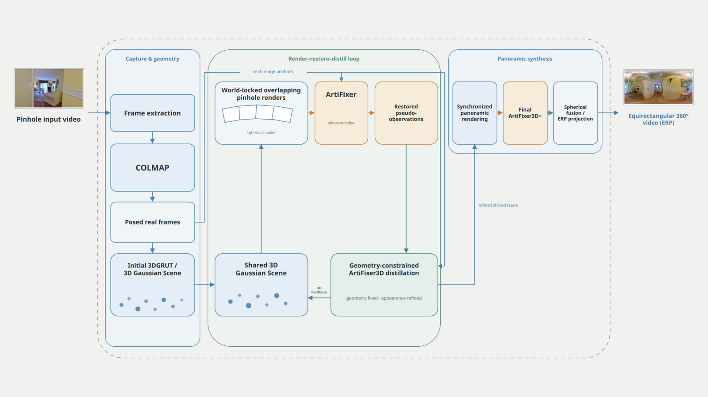

# ArtiFixer-360 framework

This directory indexes the final scientific framework delivered during the Gauvain panoramic-video work. The canonical editable diagram, its generator, validators and rendered artifacts are versioned under [`presentations/gauvain_seams`](../../presentations/gauvain_seams/).



## Pipeline represented

Pinhole video → frame extraction → COLMAP camera calibration → initial 3DGRUT/3D Gaussian scene → world-locked spherical-snake perspective renders → ArtiFixer temporal restoration → pseudo-observations → geometry-constrained ArtiFixer3D distillation → synchronized panoramic rendering → final ArtiFixer3D+ → spherical fusion and ERP projection.

The diagram makes one limitation explicit: ArtiFixer is a perspective video model and does not natively encode spherical topology. The proposed framework therefore obtains cross-direction propagation from smooth spherical-snake ordering, overlapping frustums, real-image anchors and feedback through one shared 3D scene.

## Delivered files

| File | Purpose |
|---|---|
| [`artifixer360_framework.drawio`](../../presentations/gauvain_seams/framework_diagram_tool/generated/artifixer360_framework.drawio) | Canonical editable DrawIO source |
| [`artifixer360_framework.svg`](../../presentations/gauvain_seams/framework_diagram_tool/generated/artifixer360_framework.svg) | Vector export with embedded diagram data |
| [`artifixer360_framework.pdf`](../../presentations/gauvain_seams/framework_diagram_tool/generated/artifixer360_framework.pdf) | Vector PDF export |
| [`artifixer360_framework.png`](../../presentations/gauvain_seams/framework_diagram_tool/generated/artifixer360_framework.png) | Review image |
| [`build_framework_drawio.py`](../../presentations/gauvain_seams/framework_diagram_tool/build_framework_drawio.py) | Editable-source generator |
| [`render_drawio.sh`](../../presentations/gauvain_seams/framework_diagram_tool/render_drawio.sh) | Pinned DrawIO renderer |
| [`validate_drawio_framework.py`](../../presentations/gauvain_seams/framework_diagram_tool/validate_drawio_framework.py) | Structural and export validator |
| [`Gauvain_Framework_Pipeline_Current_Editable.pptx`](../../presentations/gauvain_seams/Gauvain_Framework_Pipeline_Current_Editable.pptx) | Independently editable PowerPoint delivery |
| [`framework_pipeline_sources.md`](../../presentations/gauvain_seams/framework_pipeline_sources.md) | Scientific and visual-composition provenance |

The two embedded example images used by the deterministic generator are preserved in `presentations/gauvain_seams/framework_figure_20260731/assets/`.

## Validate the checked-in framework

From the repository root:

```bash
python presentations/gauvain_seams/framework_diagram_tool/validate_drawio_framework.py
```

To rebuild all DrawIO exports:

```bash
cd presentations/gauvain_seams/framework_diagram_tool
./render_drawio.sh
./validate_drawio_framework.py
```

The renderer bootstraps DrawIO Desktop 31.1.5 and Xvfb into a temporary cache on first use. It requires network access for that initial bootstrap but does not require ABCI or a GPU.

The independent PowerPoint artifact can be checked when `python-pptx` and Pillow are installed:

```bash
python presentations/gauvain_seams/validate_framework_pipeline.py
```

## Scope

The framework is a documented research pipeline and handover artifact, not evidence that every proposed stage produced a successful final reconstruction. The experiment archive records both positive and negative results, including the final `QC_FAIL_VISUAL_AND_TEMPORAL` verdict for the fourteen-direction diagnostic run.
